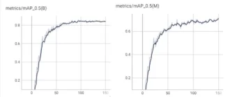
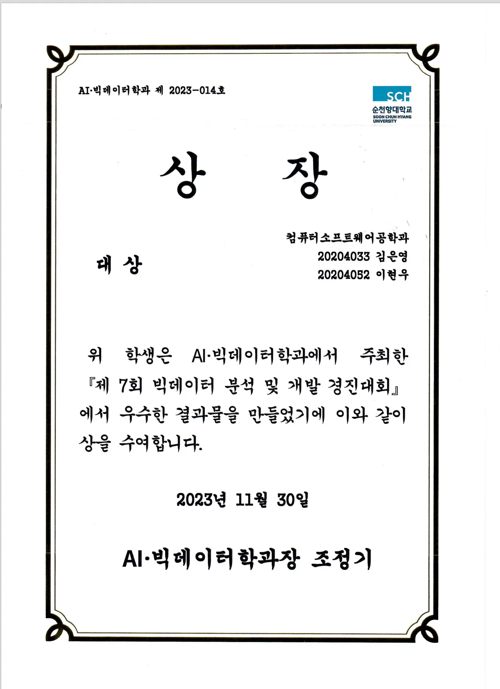

# 세그멘테이션 기반 개인형 이동장치 불법 주차 단속 시스템

> Segmentation-based Illegal Parking Enforcement System for Personal Mobility

[](https://www.python.org/)
[](https://github.com/ultralytics/yolov5)
[](LICENSE)

점자 블록 위에 불법 주차된 개인형 이동장치(전동킥보드 등)를 자동으로 탐지하는 딥러닝 기반 시스템입니다.

## 📄 Paper

**"세그멘테이션 기반 개인형 이동장치 불법 주차 단속 시스템"**

[](https://www.dbpia.co.kr/journal/articleDetail?nodeId=NODE11737137)
[](https://www.dbpia.co.kr/journal/articleDetail?nodeId=NODE11737137)

- 📎 [논문 링크 (DBpia)](https://www.dbpia.co.kr/journal/articleDetail?nodeId=NODE11737137)
- 📅 2024년도 한국통신학회 동계종합학술발표회
- 🏫 순천향대학교


## 📋 개요

개인형 이동장치의 사용 증가로 도보에 무분별하게 방치되는 상황이 증가하고 있습니다. 특히 점자 블록 위의 불법 주차는 시각 장애인의 통행을 방해하고 안전사고를 유발할 수 있습니다.

본 시스템은 YOLOv5 Instance Segmentation 모델을 활용하여 점자 블록과 개인형 이동장치를 인식하고, 두 객체 사이의 거리를 측정하여 불법 주차 여부를 판단합니다.

### 시스템 구조

```
┌─────────────┐     ┌─────────────┐     ┌─────────────────────────────┐
│   Camera    │────▶│   Network   │────▶│      Learning Server        │
│  (Input)    │     │             │     │  ┌─────────────────────┐    │
└─────────────┘     └─────────────┘     │  │  Detection Engine   │    │
                                        │  │  (YOLOv5 Seg)       │    │
                                        │  └──────────┬──────────┘    │
                                        │             │               │
                                        │  ┌──────────▼──────────┐    │
                                        │  │  Checking Engine    │    │
                                        │  │  (Illegal Parking)  │    │
                                        │  └─────────────────────┘    │
                                        └─────────────────────────────┘
```

## 🚀 빠른 시작

### 요구사항

```bash
pip install ultralytics opencv-python numpy
```

### 실행

```bash
# 이미지 분석
python illegal_parking_simple.py --weights best.pt --source test.jpg

# 비디오 분석
python illegal_parking_simple.py --weights best.pt --source video.mp4

# 웹캠 실시간 분석
python illegal_parking_simple.py --weights best.pt --source 0 --view-img

# RTSP 스트림
python illegal_parking_simple.py --weights best.pt --source rtsp://...
```

## 📁 파일 구조

```
.
├── illegal_parking_simple.py    # 간단한 단독 실행 버전 (권장)
├── illegal_parking_detection.py # YOLOv5 레포지토리 기반 버전
├── best.pt                      # 학습된 모델 가중치
├── README.md
└── runs/
    └── detect/                  # 탐지 결과 저장
```

## ⚙️ 사용법

### 기본 옵션

| 옵션 | 기본값 | 설명 |
|------|--------|------|
| `--weights` | `best.pt` | 학습된 모델 가중치 경로 |
| `--source` | `test.jpg` | 입력 소스 (이미지/비디오/웹캠/스트림) |
| `--illegal-distance` | `100` | 불법 주차 판단 거리 임계값 (픽셀) |
| `--conf-thres` | `0.25` | Confidence threshold |
| `--save-dir` | `runs/detect` | 결과 저장 디렉토리 |
| `--view-img` | `False` | 결과 실시간 표시 |
| `--no-save` | `False` | 결과 저장 안함 |

### 예시

```bash
# 기본 실행
python illegal_parking_simple.py --weights best.pt --source ./images/

# 거리 임계값 조정 (150픽셀 이내면 불법주차)
python illegal_parking_simple.py --weights best.pt --source test.jpg --illegal-distance 150

# 높은 confidence로 필터링
python illegal_parking_simple.py --weights best.pt --source test.jpg --conf-thres 0.5

# 실시간 표시 + 저장 안함
python illegal_parking_simple.py --weights best.pt --source 0 --view-img --no-save
```

## 🔧 알고리즘

### 불법 주차 판단 로직

```
Algorithm: Illegal Parking Check

1: for each detection do
2:     xyxy, class ← detection
3:     center_x ← int((xyxy[0] + xyxy[2]) / 2)
4:     center_y ← int((xyxy[1] + xyxy[3]) / 2)
5:     if class == 'guide_block' then
6:         guide_block_centers.append((center_x, center_y))
7:     else if class == 'scooter' then
8:         scooter_centers.append((center_x, center_y))
9:     end if
10: end for
11: for each scooter_center in scooter_centers do
12:     for each guide_block_center in guide_block_centers do
13:         x1 ← (guide_block_center[0] - scooter_center[0])²
14:         y1 ← (guide_block_center[1] - scooter_center[1])²
15:         distance ← √(x1 + y1)
16:         if distance ≤ illegal_threshold then
17:             print("Illegal parking")
18:         else
19:             print("Legal parking")
20:         end if
21:     end for
22: end for
```

### 핵심 함수

| 함수 | 설명 |
|------|------|
| `calculate_center(xyxy)` | Bounding box 중심점 계산 |
| `calculate_euclidean_distance(p1, p2)` | 두 점 사이 유클라디안 거리 계산 |
| `check_illegal_parking(detections)` | 불법 주차 판단 로직 |
| `visualize_result(img, result)` | 결과 시각화 |

## 📊 모델 학습

### 데이터셋

- **점자 블록**: AI-HUB 인도 보행 영상데이터 (570장)
- **개인형 이동장치**: 인터넷 크롤링 (196장)
- **데이터 증강**: 회전, 노이즈, 색상 반전, 밝기 조절
- **총 데이터**: 학습 2,100장, 검증 186장

### 학습 환경

```
- GPU: Quadro RTX-5000
- Model: YOLOv5l Instance-Segmentation
- Epochs: 150
- Batch size: 32
```

### 성능

| 메트릭 | 값 |
|--------|-----|
| mAP@0.5 (Box) | 84.3% |
| mAP@0.5 (Mask) | 71.7% |

### 학습 결과 그래프

<div align="center">


*mAP@0.5 학습 곡선 (Box: 84.3%, Mask: 71.7%)*
</div>

## 🎬 동작 결과

### 데모 영상

<div align="center">

| 테스트 1 | 테스트 2 |
|:--------:|:--------:|
| <video src="assets/demo_1.mp4" width="300"> | <video src="assets/demo_2.mp4" width="300"> |

</div>

> **Note:** GitHub에서 비디오가 재생되지 않는 경우, 파일을 다운로드하여 확인하세요.

### 학습 방법

```bash
# YOLOv5 세그멘테이션 학습
python segment/train.py \
    --data data.yaml \
    --weights yolov5l-seg.pt \
    --img 640 \
    --epochs 150 \
    --batch-size 32
```

**data.yaml 예시:**
```yaml
path: ./dataset
train: images/train
val: images/val

names:
  0: guide_block
  1: scooter
```

## 📷 결과 예시

탐지 결과는 다음과 같이 시각화됩니다:

- 🟢 **초록색**: 점자 블록 (Bounding box + 중심점)
- 🔵 **파란색**: 개인형 이동장치 (Bounding box + 중심점)
- 🔴 **빨간 선**: 불법 주차 시 두 객체 연결선 + 거리 표시
- 상단 배너: 판단 결과 (ILLEGAL PARKING / Legal Parking)

## 🔌 API 사용

```python
from illegal_parking_simple import IllegalParkingDetector

# 초기화
detector = IllegalParkingDetector(
    weights='best.pt',
    illegal_distance=100,
    conf_thres=0.25
)

# 단일 이미지 분석
results = detector.predict(
    source='test.jpg',
    save_dir='output',
    view_img=True
)

# 결과 확인
for result in results:
    print(f"파일: {result['path']}")
    print(f"불법주차: {result['parking_result']['is_illegal']}")
    print(f"탐지 객체 수: {len(result['detections'])}")
```

## 📝 클래스 설정

모델 학습 시 클래스 순서에 따라 코드의 클래스 ID를 수정해야 합니다:

```python
# illegal_parking_simple.py 내부
CLASS_GUIDE_BLOCK = 0  # 점자 블록 클래스 ID
CLASS_SCOOTER = 1      # 개인형 이동장치 클래스 ID
```

## 🏆 수상

**제7회 빅데이터 분석 및 개발 경진대회 대상**

[](https://github.com/mainvoid00/Illegal_Parking_System)

- 🏅 AI·빅데이터학과 주최
- 📅 2023년 11월 30일

<details>
<summary>📜 상장 보기</summary>
<br>
<div align="center">

</div>
</details>


